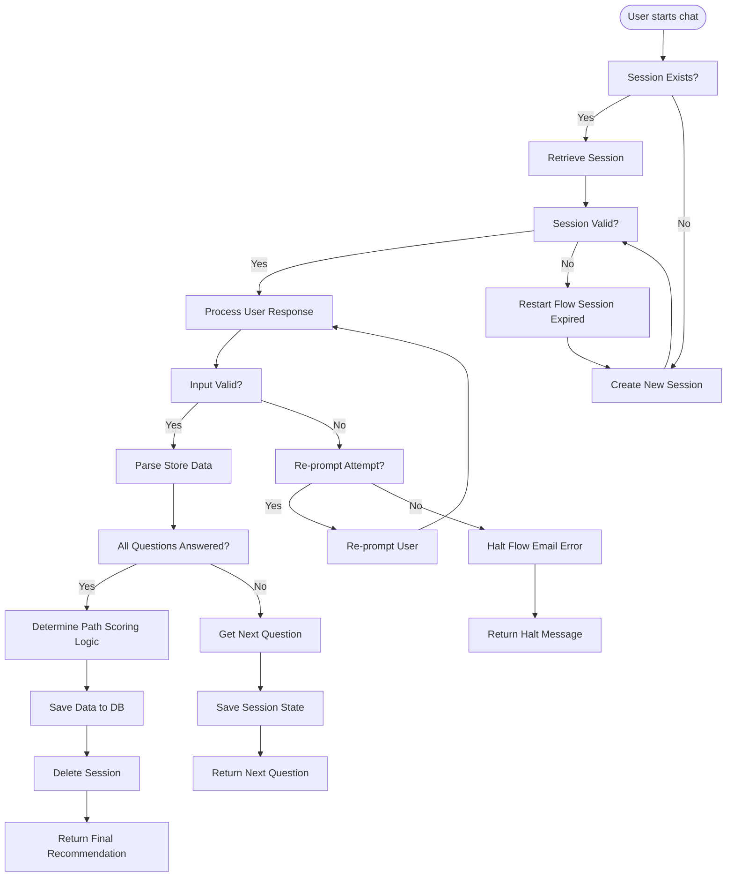

# Andromeda Onboarding Chatbot

[](https://vercel.com/new/clone?repository-url=YOUR_GITHUB_REPO_URL_HERE&env=SUPABASE_URL,SUPABASE_ANON_KEY,SUPABASE_SERVICE_ROLE_KEY,KV_URL,KV_REST_API_URL,KV_REST_API_TOKEN,PATH_URL_CONTRACTOR,PATH_URL_HACKER,PATH_URL_VISIONARY_PATH,PATH_URL_AI_NAVIGATOR,PATH_URL_AMBASSADOR,PATH_URL_EXPLORER_PATH)

**A modular, efficient, and user-friendly chatbot designed to onboard new users into the Andromeda ecosystem. It intelligently guides users through a questionnaire, determines the most suitable path using a weighted scoring system and hard requirements, and persists the data.**

This chatbot provides a guided questionnaire experience, leveraging a modern web stack and AI-powered components to:

- **Intelligently gather key information** from new users about their skills, interests, and goals.
- **Deterministically analyze user profiles** using a weighted scoring system and predefined requirements to recommend the most suitable onboarding path.
- **Provide clear, actionable guidance** by directing users to tailored resources and community pathways within Andromeda.
- **Persist structured user data** in a database for future analysis and personalized engagement.

This implementation prioritizes a **structured, questionnaire-based approach** for reliability and efficiency, ensuring a seamless onboarding experience for a diverse range of users, from technical developers to community ambassadors.

## Project Structure (Next.js 15+)

```text
project_root/
├── src/
│   ├── app/
│   │   ├── api/
│   │   │   └── onboarding/
│   │   │       ├── message/
│   │   │       │   └── route.ts         # Main API Route Handler 
│   │   │       ├── back/                # API route for going back in the questionnaire
│   │   │       ├── restart/             # API route for restarting the questionnaire
│   │   │       └── retry-save/          # API route for retrying failed data saves
│   │   ├── [path-specific directories]  # Pages for each user path
│   │   ├── layout.tsx                   # Root Layout Component
│   │   ├── page.tsx                     # Home Page (renders ChatContainer)
│   │   └── globals.css                  # Global Styles (Tailwind CSS v4, Dark Mode Theme)
│   ├── components/
│   │   ├── chat/                        # Chat-related components
│   │   ├── layout/                      # Layout components
│   │   ├── cards/                       # Card components for UI
│   │   ├── ui/                          # Shadcn/ui Components (Button, Card, etc.)
│   │   └── ErrorBoundary.tsx            # Error Boundary for React
│   ├── lib/
│   │   ├── session.ts                   # Session Management Service (Upstash Redis)
│   │   ├── questionnaire.ts             # Questionnaire Definition (Questions, Options)
│   │   ├── parsing.ts                   # Input Parsing & Validation Logic
│   │   ├── pathDetermination.ts         # Path Determination Rules
│   │   ├── supabase.ts                  # Database Interaction Service (Supabase)
│   │   ├── github.ts                    # GitHub integration utilities
│   │   ├── types.ts                     # TypeScript Interface Definitions
│   │   └── utils.ts                     # Utility Functions
├── public/                              # Static assets
│   └── icons/                           # Icon assets
├── README.md                            # THIS FILE - Project Documentation
├── next.config.js                       # Next.js Configuration File
├── package.json                         # Project Dependencies and Scripts
├── pnpm-lock.yaml                       # PNPM Dependency Lock File
├── tailwind.config.js                   # Tailwind CSS Configuration
└── tsconfig.json                        # TypeScript Configuration
```

## Onboarding Flow Overview

Here's a simplified diagram of the user onboarding flow:



## Key Features

- **Guided Onboarding Questionnaire:** Presents a clear, step-by-step questionnaire to new users, ensuring consistent data collection.
- **Deterministic Path Recommendation:** Applies a weighted scoring system and predefined requirements to accurately suggest the most relevant Andromeda ecosystem path.
- **Multiple Onboarding Paths:** Supports six distinct paths: Contractor, Hacker, Visionary Path, AI Navigator, Ambassador, and Explorer Path.
- **Data Persistence:** Stores collected user profile data in a Supabase PostgreSQL database for future analysis and engagement.
- **Modern Web Stack:** Built with Next.js 15+, React 19, TypeScript 5, Tailwind CSS 4, and Shadcn/ui, ensuring performance, maintainability, and a modern user experience.
- **Keyboard Accessibility:** Supports keyboard number input for quick button selection in multiple-choice questions.
- **Input Validation & Error Handling:** Includes client-side and server-side validation, graceful error handling, and user re-prompting for invalid input.
- **Session Management:** Uses Upstash Redis for robust server-side session management with automatic session expiry.
- **Easy Deployment:** Designed for seamless deployment on Vercel, leveraging serverless functions and managed services.

## Setup

1. **Clone the repository:**

   ```bash
   git clone [repository-url]
   cd oop-1
   ```

2. **Install dependencies using pnpm:**

   ```bash
   # Install pnpm if not already installed
   npm install -g pnpm
   # Or with corepack (recommended for Node 16.13+)
   corepack enable && corepack prepare pnpm@latest --activate
   
   # Install project dependencies
   pnpm install
   ```

3. **Environment Configuration:**

   - **Create a `.env.local` file** in the project root and populate it with the following environment variables:

     ```dotenv
     # .env.local - Local Development Environment Variables

     # Supabase Project Settings (from supabase.com)
     NEXT_PUBLIC_SUPABASE_URL=[Your_Supabase_Project_URL]
     NEXT_PUBLIC_SUPABASE_ANON_KEY=[Your_Supabase_Anon_Public_Key]
     SUPABASE_SERVICE_ROLE_KEY=[Your_Supabase_Service_Role_Secret_Key]

     # Upstash Redis (from Vercel Marketplace Integration)
     UPSTASH_REDIS_REST_URL=[Your_KV_REST_API_URL]
     UPSTASH_REDIS_REST_TOKEN=[Your_KV_REST_API_TOKEN]

     # Onboarding Path URLs - Replace with your desired destination URLs
     PATH_URL_CONTRACTOR="[contractor-path-url]"
     PATH_URL_HACKER="[hacker-path-url]"
     PATH_URL_VISIONARY_PATH="[visionary-path-url]"
     PATH_URL_AI_NAVIGATOR="[ai-navigator-path-url]"
     PATH_URL_AMBASSADOR="[ambassador-path-url]"
     PATH_URL_EXPLORER_PATH="[explorer-path-url]"

     NODE_ENV=development
     ```

4. **Run the development server:**

   ```bash
   pnpm dev
   ```

   Open your browser and access the application at `http://localhost:3000`.

## Usage

The Andromeda Onboarding Bot presents a chat-like interface where users are guided through a series of questions.

1. **Start the Onboarding:** Upon accessing the application, the chatbot initiates the onboarding process with a welcome message and the first question.
2. **Answer Questions:** Users respond to each question sequentially, providing information about their skills, experience, and goals.
3. **Multiple Input Types:** The chatbot supports various input methods:
   - **Text Input:** For open-ended questions like name, email, and handles.
   - **Button Selection:** For multiple-choice questions, allowing users to select from predefined options.
   - **Conditional Text Input:** For questions requiring additional details based on a button selection.
4. **Progress Tracking:** A progress bar in the chat header visually indicates the user's advancement through the questionnaire.
5. **Path Recommendation:** After answering all questions, the chatbot analyzes the user's responses and presents a recommended onboarding path.

## User Paths

Based on user responses, the chatbot recommends one of the following paths:

1. **Contractor Path:** For technically proficient users with programming skills interested in building applications and contributing to projects.
2. **Hacker Path:** For technically inclined users interested in hackathons, bounties, and blockchain security.
3. **Visionary Path:** For users with a product-oriented mindset interested in suggesting new features and use cases for the Andromeda ecosystem.
4. **AI Navigator Path:** For users with experience in AI/ML who want to explore AI-related projects and integrations within Andromeda.
5. **Ambassador Path:** For users passionate about community building and promoting Andromeda, even without deep technical expertise.
6. **Explorer Path:** A general introductory path for users new to Web3 or unsure of their specific goals, providing fundamental learning resources.

## Testing

The project includes a comprehensive integration test suite built with Jest to ensure the backend API functions correctly:

```bash
pnpm test
```

## Technology Stack

- **Frontend:**
  - Next.js 15+
  - React 19
  - TypeScript 5
  - Tailwind CSS 4
  - Shadcn/ui components
  - next-themes for dark/light mode

- **Backend:**
  - Next.js App Router API Routes
  - Upstash Redis for session management
  - Supabase for data persistence

- **Development Tools:**
  - PNPM package manager
  - ESLint for code linting
  - Prettier for code formatting
  - Jest for testing

## Customization

The Andromeda Onboarding Bot is designed to be flexible and customizable. Key areas for modification include:

- **Questionnaire Content:** Modify the questions in `src/lib/questionnaire.ts`.
- **Path Determination Logic:** Adjust the weights and requirements in `src/lib/pathDetermination.ts`.
- **Styling:** Customize appearance via Tailwind CSS classes and the Shadcn/ui theme.

## Future Enhancements

Potential enhancements for future versions include:

1. **Enhanced Input Parsing with LLMs:** Integrate an LLM for more flexible natural language understanding.
2. **More Granular Path Recommendations:** Refine the path determination logic to provide more nuanced path suggestions.
3. **Personalized Resource Recommendations:** Dynamically tailor resource recommendations based on detailed analysis of user responses.
4. **User Accounts & Profiles:** Implement user authentication and persistent user profiles.
5. **Analytics Dashboard:** Develop an admin dashboard to visualize key onboarding metrics.

## License

This project is licensed under the MIT License.
